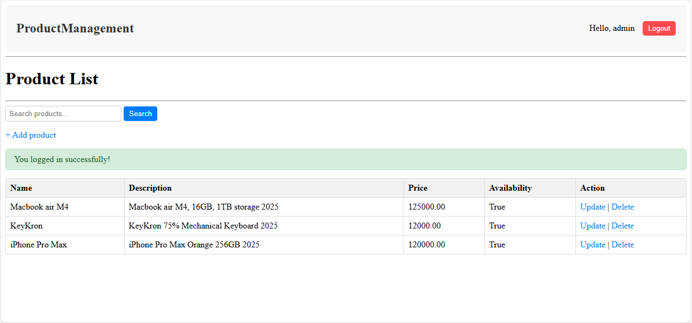

# 🛒 Product Management System (Django)

A simple, secure **Product Management Web App** built with Django’s **Class-Based Views (CBVs)**.  
It includes **user authentication**, **CRUD operations**, and a **search feature** for managing products efficiently.

---

## 🚀 Features

- **User Authentication**
  - Sign up, login, logout (handled using Django auth system)
  - Access control via `LoginRequiredMixin`
- **Product Management**
  - Create, Read, Update, Delete products
  - Instant success messages for each action
- **Search Functionality**
  - Search products by name directly from the list view
- **Clean UI**
  - Simple inline navigation bar and styled table layout
- **Reusable Architecture**
  - Custom `SuccessMessageMixin` for consistent messaging across views

---

## 🧩 Tech Stack

| Component | Description |
|------------|-------------|
| **Backend** | Django 5+ |
| **Frontend** | HTML, CSS (Vanilla) |
| **Database** | SQLite (default) |
| **Auth** | Django’s built-in authentication system |
| **Views** | Class-Based Views (`ListView`, `CreateView`, `UpdateView`, `DeleteView`, `LoginView`) |

---

## 🖼️ Screenshot

Below is a screenshot of the live project interface:

## 🧠 Learnings

- Deep understanding of Django Class-Based Views (CBVs)

- Usage of mixins like LoginRequiredMixin and custom message handling

- Clean project structure and DRY (Don’t Repeat Yourself) principles

- How to build reusable authentication and CRUD logic